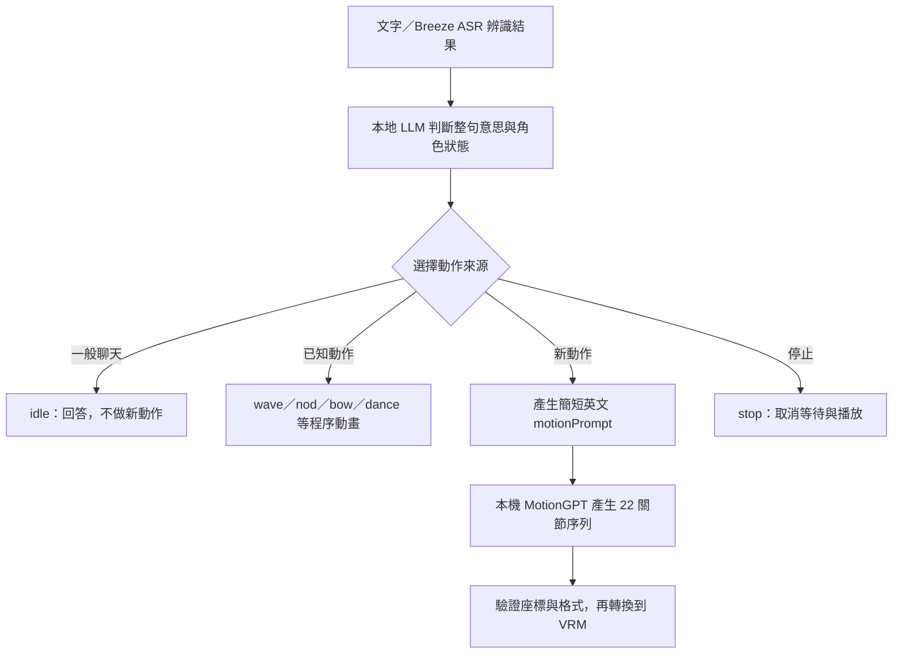

# 從一句話到身體動作：語意判斷與 MotionGPT

查核日期：2026-10-09。本地 ACT 與 MotionGPT 是預設路徑。新版加入**可選的 OpenAI Decisions 動作判斷**。
目前沒有使用真實付費 API 測量延遲、語意正確率或費用，不能宣稱這台 Mac 已獲得加速。

## 先判斷使用者要什麼

「拳擊」出現在句子裡，不代表角色必須打拳。先分辨要求、敘述、否定與停止，再選擇動作。
以下是期望行為與課堂測試案例，不是每個模型都已通過的結果。

| 使用者說法 | 語意 | 期望動作 |
| --- | --- | --- |
| 「跟我揮揮手。」 | 要求表演已知動作 | `wave`，角色右手揮手。 |
| 「今天上課很開心。」 | 描述情緒 | 可以微笑，`idle`，不必自動跳舞。 |
| 「我昨天去上拳擊課。」 | 敘述經歷 | 回應內容，`idle`。 |
| 「請解釋拳擊是什麼。」 | 要求說明 | 用語言回答，`idle`。 |
| 「打一套拳給我看。」 | 要求表演新動作 | `generate`，產生拳擊動作描述。 |
| 「不要跳舞，陪我聊聊。」 | 否定動作要求 | `idle`，不因「跳舞」關鍵字啟動動畫。 |
| 「雙手舉過頭頂，伸個懶腰。」 | 要求表演新動作 | `generate`，描述雙臂向上伸展。 |
| 「先不要動，等我叫你。」 | 限制當前行為 | 保持靜止，不自行安排延後動作。 |
| 「停下來。」 | 停止當前動作 | `stop`，取消前端等待與播放。 |
| 「揮左手。」 | 明確指定另一側 | 不能拿固定右手的 `wave` 充當左手。使用生成路徑，或說明能力限制。 |

也要區分「使用者的請求」和引用內容。例如「他說『跳舞給我看』」可以只是敘述，不一定是在命令角色。

## 本地流程：兩種動作來源



目前快速動作包括 `idle`、`nod`、`shake`、`wave`、`bow`、`celebrate`、`dance`、`sway`。
它們是固定規則的程序動畫。`wave` 使用角色自己的右手，`dance` 與 `sway` 是兩種既定舞動。

新動作走 MotionGPT。語言模型先把使用者的要求整理成簡單英文，例如：

```text
<|ACT {"emotion":"neutral","motion":"generate","motionPrompt":"A person stretches both arms above their head."}|>
好，我試著把雙手舉高伸展。
```

ACT 是控制資料，後面的文字才交給角色說話。台語角色也可以使用英文 `motionPrompt`，不需要把說話語言改成英文。
新動作描述限制 1–500 字元，內容描述人的身體動作，不包含程式、網址或工具指令。

自動生成需要 VRM、動作模組已啟用，以及「允許對話自動生成動作」已明確開啟。
安裝 MotionGPT 不會自動開啟這個對話開關。使用 Live2D 或未啟用時，不承諾已完成生成動作。

原始碼入口：

- [角色的語意與 ACT 提示詞](../../../packages/stage-ui/src/constants/local-character-motion.ts)
- [ACT 欄位解析](../../../packages/pipelines-audio/src/llm-streaming-control/payloads.ts)
- [前端生成狀態與取消](../../../packages/stage-ui/src/stores/modules/motion.ts)
- [舞台選擇程序動畫或生成動畫](../../../packages/stage-ui/src/components/scenes/Stage.vue)

這個頁面不把「停止前端等待」等同於「後端推論執行緒立即終止」。已開始的模型推論仍能完成，但過期結果不能再觸發播放。

## 為什麼手動輸入中文會和聊天不同？

聊天時，語言模型會把要求整理成英文 `motionPrompt`。舊的手動輸入欄卻直接把中文交給 MotionGPT。
本次實查 tokenizer，「跳高！」變成 `Generate motion: <unk>!</s>`，中文動作資訊已經遺失。
這不能解讀成模型「懂中文但選錯動作」。[Tokenizer 原始證據](../results/motiongpt/jump-language/tokenizer-probe.json)

現在按一次「生成並預覽」，中文會先透過目前在「意識」選用的本機語言模型轉成英文，再送入 MotionGPT。
畫面保留原文、實際英文及轉換模型，方便檢查左右、前後、次數與否定是否正確。
英文描述保留直接生成的路徑，不另外呼叫語言模型。

這裡只允許 loopback 本機 provider，包含 `127.0.0.1`、`localhost` 與 `[::1]`，不會自動改選模型或下載模型。
如果目前選的是雲端 provider、未選模型、轉換逾時或仍回傳中文，就顯示原因，不把原始中文悄悄送入 MotionGPT。
可以改選本機對話模型，或直接輸入英文。此處不使用選配的 Decisions API。

轉換只處理這次動作描述，不附上角色聊天歷史，不允許工具或網頁搜尋。
輸出格式不符時最多修正重試一次，總等待上限為 60 秒。
取消、更換角色或語言模型後，舊翻譯和舊動畫都失去播放資格。

用真正的前端 helper 與既有 Gemma 4 12B 本機服務測得：

| 原文 | 實際英文 | 本次轉換耗時 |
| --- | --- | --- |
| 跳高！ | A person jumps high into the air. | 2.259 秒 |
| 請用左手揮手打招呼 | A person waves with their left hand. | 0.676 秒 |
| 不要跳，請向前鞠躬一次。 | A person performs one forward bow without jumping. | 0.698 秒 |

這是三次本機轉換紀錄，不是通用效能保證，也不是動作品質或原生 UI 播放測試。
英文轉對後，MotionGPT 仍有自己的生成限制，需要分開檢查。[本機翻譯原始結果](../results/motiongpt/jump-language/gemma-translation-smoke.json)

新轉換測試及既有動作生命週期測試共 26 項通過，stage-web 型別檢查與修改檔案的 ESLint 通過。
測試涵蓋英文零翻譯請求、禁止雲端、中文不直接轉送、格式重試、超時、換模型及取消後不得播放。

原始碼：[本機描述轉換與英文驗證](../../../packages/stage-ui/src/libs/motion-prompt.ts)、[取消及過期結果保護](../../../packages/stage-ui/src/stores/modules/motion-prompt.ts)。

## Decisions API 能放在哪一層？

OpenAI 官方名稱是 **Decisions API**，使用獨立 `POST /v1/decisions`。
查核時官方標示 public beta，模型為 `gpt-6-luna`。它提供條件機率、固定選項選擇與等級評分。[官方指南](https://developers.openai.com/api/docs/guides/decisions)

| 官方類型 | 輸出 | 在本課程的設計用途 |
| --- | --- | --- |
| `predicate` | 條件成立的機率 | 是否真的要求角色表演動作。 |
| `choice` | 指定選項之一、機率分布、confidence | 選 `idle`、`stop`、某個已知動作或 `generate`。 |
| `score` | 按有序等級計算的分數 | 實驗性判斷圖像中的姿勢符合度。 |

API 接收文字與 inline 圖片。它不直接接收音訊，也不回傳自由格式的骨架資料。
`choice` 必須事先提供 2–255 個不同選項；應用程式仍負責驗證及執行結果，也要處理 `refusal`。[API schema](https://developers.openai.com/api/reference/resources/decisions/methods/create)

官方的語音案例正是「逐字稿＋目前狀態 → 選擇可用動作 → 程式執行」。其中明列機器人手勢範例。
文件也要求執行前重新檢查動作是否仍可用，已取消的請求不能繼續執行。[語音連接 Decisions](https://developers.openai.com/api/docs/guides/decisions-voice)

## 這次實作：本地和雲端比誰先選出有效動作

選配判斷器在「設定 → 動作」啟用。預設關閉，關閉時不發送 Decisions 請求。
目前只能從 AIRI Local 的 `http://127.0.0.1:17900` 使用這個功能，開發站或外部網站不會接收金鑰。
沒有金鑰、服務失敗或未選用雲端時，保留本地語言模型的 ACT 路徑。

```text
這一輪使用者文字／本地 ASR 逐字稿
  ├─ 原本的語言模型 → ACT → 動作
  └─ 明確選用 Decisions → 本地 manager → OpenAI 固定選項判斷
                              → 驗證結果 → 動作
第一個有效的結果取得這一輪的動作執行權，另一個不能再重播。
```

雲端只取得這一輪的文字和固定分類規則。本整合不把麥克風音訊、圖片附件、歷史對話或骨架送給 Decisions。
角色的說話和 TTS 繼續走原本設定，選動作不會改變對話模型或聲音。
本文以課堂的本地語言模型為例。若自行換成雲端聊天 provider，原本的 ACT 路徑也會依該 provider 傳送資料。

雲端結果的初始 confidence 門檻為 `0.6`，低於門檻就交回本地。這是未校準的保守預設，不代表 60% 正確率。
拒答、缺少信心值或無效格式也不會取得執行權。

兩個判斷器平行執行，不是先等雲端失敗才開始本地模型。
因此既有模型若先傳回有效 ACT，就直接使用它。這個設計不能保證雲端一定更快或更準。

| Decisions 選項 | 本地執行方式 |
| --- | --- |
| `idle`、`stop`、`wave` 等已知動作 | 執行既有程序動畫，`wave` 固定使用角色右手。 |
| `generated_stretch` | 使用固定英文模板，請本機 MotionGPT 生成雙手向上伸展。 |
| `generated_squat`、`generated_boxing` | 使用固定英文模板，生成蹲起或拳擊。 |
| `generated_left_wave` | 使用左手英文模板生成，不拿右手 `wave` 代替。 |
| `defer`、拒答、低信心或無效輸出 | 不取得動作執行權，保留本地 ACT。 |

這些模板由應用程式事先定義，不是 Decisions 寫出新文字。
新的複雜動作仍靠原本的語言模型產生英文 `motionPrompt`，再交給 MotionGPT。
若需要雲端產生任意新欄位或文字，那是另一個生成流程，例如 Responses 的 [Structured Outputs](https://developers.openai.com/api/docs/guides/structured-outputs)。本整合沒有加入該流程。

所有生成選項仍要求 VRM、動作模組啟用，以及「允許對話自動生成動作」開啟。
雲端選到生成模板，不會越過這三個條件。未開啟自動生成時，仍可判斷可用的程序動畫。

### 金鑰與資料範圍

使用者可以提供本次工作階段的金鑰，或明確選取已設定的 OpenAI provider。
本次工作階段的金鑰保存在記憶體，不寫入新的 localStorage、設定檔或後端日誌。
選取既有 provider 時，沿用該 provider 原有的金鑰保存方式，不能稱為「所有金鑰都只存記憶體」。

前端把金鑰送到同一來源的本地 manager。後端才用 `Authorization: Bearer` 呼叫固定的 `https://api.openai.com/v1/decisions`。
請求還需通過本地 Host、Origin、JSON 格式與工作階段 token 驗證。
金鑰不包進 App，不放在 URL，不在回應或錯誤訊息回顯。後端不持久保存金鑰或這一輪文字。

官方 API 範例使用 Bearer 驗證和 JSON，模型為 `gpt-6-luna`，沒有要求額外的 beta header。[API reference](https://developers.openai.com/api/reference/resources/decisions/methods/create)

### 超時、取消與重複動作

前端等待上限為 5 秒，超時就放棄雲端結果。本地模型持續執行。
後端網路操作以 4 秒預算限制，不自動重試。作業系統 DNS 解析不保證遵守這個上限。
取消前端等待不代表已送達 OpenAI 的請求沒有處理或計費。

新對話輪、停止、換角色、離開舞台或停用判斷器會撤銷舊結果的執行資格。
延遲回來的結果不能在新角色或新對話中播放。動作一輪只選一次，後來隨 TTS 到達的同輪 ACT 不能再觸發同一動作。
情緒控制與正常語音仍各自處理。

### 延遲與費用要怎麼教

官方指南列出 Decisions 的 `gpt-6-luna` 價格為每百萬 input tokens US$0.10，只對 input 計費。
區域處理與長上下文另有加價條件。這是查核當天的公開價格，課堂使用前再確認。[官方價格說明](https://developers.openai.com/api/docs/guides/decisions#pricing-and-availability)

官方所述的約 10 倍速度是對 Responses API 的比較，不是對這台 Mac、本地模型或 MotionGPT 的保證。
介面顯示的毫秒數，是本地 manager 呼叫 OpenAI 到解析回應的時間，包含網路往返。
它不包含 ASR、TTS、MotionGPT、VRM 播放或前端到 manager 的耗時，也不等同於模型純推論時間。

有真實 API 授權後，再以同一組標註句子比較純本地與選配模式。
記錄首次動作延遲、p50／p95、誰先取得執行權、選錯或漏做、超時比例與 API input tokens。
測試要分開記錄冷啟動、暖啟動、網路條件及語言。假回應只能證明程式分支，不代表模型速度或理解能力。

## 分清楚四種成功

1. **聽對**：Breeze ASR 是否保留「不要」、左右手與台語語意。
2. **選對**：語言模型或 Decisions 是否選對動作來源。
3. **生成對**：MotionGPT 的原始骨架是否符合描述。
4. **播放對**：VRM 的左右、前後、關節與姿態恢復是否正確。

Structured Outputs 或固定選項能約束格式，不能證明判斷正確。
Decisions 的 confidence 也不能直接當作課堂正確率。門檻需要由自己的標註案例設定。[官方判讀指引](https://developers.openai.com/api/docs/guides/decisions#interpret-the-answers)

例如，這次 MotionGPT 的鞠躬輸出會前彎再回正，卻多了抬左腳。
即使路由正確選到「鞠躬」，仍不能宣稱整段動作完全遵從提示。[原始骨架檢查](../results/motiongpt/skeleton-preview-audit.md)

課堂可讓不同本地模型及選配雲端判斷器，回答同一組要求、否定、敘述與停止案例。
分別記錄路由結果、錯誤觸發次數、漏做次數、延遲與動作品質，不把所有錯誤都歸給「模型太小」。

## 已驗證的程式邊界與課堂實驗

2026-10-09 的後端驗證使用假金鑰和模擬 transport，沒有發送真實 OpenAI 請求。
`python3 course/ntu-vh2026/installer/test-decisions.py`：16 項通過。
測試包含固定官方契約、停用／缺金鑰零請求、拒答、錯誤去敏、錯誤來源攔截、限時與不跟隨 redirect。

前端使用同樣的假回應，兩個測試檔共 22 項通過（包含後續補上的本地 ACT 即時分派測試）：

```sh
./node_modules/.bin/vitest run --config packages/stage-ui/vitest.config.ts --project node src/libs/motion-decisions.test.ts src/stores/modules/motion-decisions.test.ts
```

上述自動化驗證未輸入使用者金鑰。後續 0.4.0 原生 App 的開關、金鑰欄位、缺 key 本地伸展及桌寵設定驗證，另見[交付驗證紀錄](../results/motiongpt/decisions-validation.md)。

| 測試情境 | 要確認的行為 |
| --- | --- |
| 第一次啟動、未勾選 Decisions | 本地 ACT 正常。雲端 transport 呼叫次數為 0。 |
| 已勾選，但沒有金鑰 | 顯示缺金鑰，保留本地。雲端呼叫次數為 0。 |
| 一般聊天、否定動作、引用別人說話 | 對照標註語意，不把關鍵字自動當成命令。 |
| `confidence=0`、低於 `0.6` | 不取得動作執行權，本地仍可接手。 |
| 拒答、缺欄位、NaN、未知動作 | 不執行無效雲端動作。 |
| 本地 ACT 先到 | 本地動作只播放一次，晚到雲端與同輪 TTS ACT 不重播。 |
| 雲端有效結果先到 | 雲端動作只播放一次，本地 ACT 保留語音／情緒用途。 |
| 雲端超時、401、429、服務失敗 | 不重試，不回顯金鑰，本地繼續。 |
| 關閉自動生成，雲端選拳擊模板 | 不啟動 MotionGPT。 |
| 等待期間按停止、換角色或開始新輪 | 舊回應即使到達也不能觸發播放。 |
| 取回結果後，播放前立即取消 | 播放前的第二次驗證攔截過期結果。 |
| 清除工作階段金鑰 | 後續需要重新輸入。既有 provider 金鑰不受此按鈕影響。 |

前兩列的零請求指 Decisions 功能，不包含使用者自行選用的其他雲端聊天或語音 provider。
語意句子的正確率仍需用真正模型評量。模擬 `wave` 回應成功，不能證明模型真的理解「揮手」。

實作入口：

- [後端固定 API 與動作模板](../installer/decisions.py)
- [後端契約與保密測試](../installer/test-decisions.py)
- [前端回應驗證與同源呼叫](../../../packages/stage-ui/src/libs/motion-decisions.ts)
- [本地／雲端執行權與取消狀態](../../../packages/stage-ui/src/stores/modules/motion-decisions.ts)
- [前端請求與回應測試](../../../packages/stage-ui/src/libs/motion-decisions.test.ts)
- [動作執行權、取消與停用測試](../../../packages/stage-ui/src/stores/modules/motion-decisions.test.ts)
