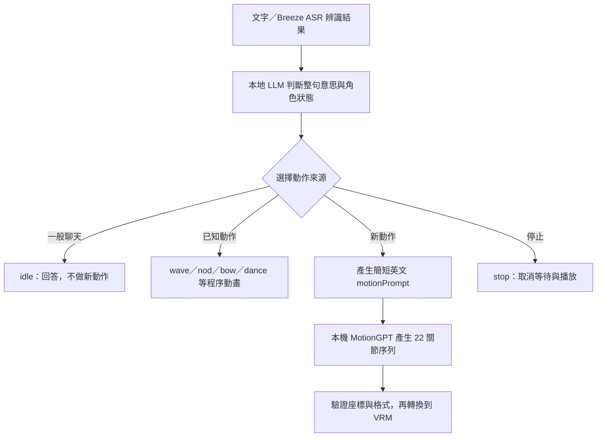

# 從一句話到身體動作：語意判斷與 MotionGPT

查核日期：2026-10-08。本地 ACT 與 MotionGPT 流程已存在於本專案。本文的 OpenAI Decisions 路由是**選配設計，尚未整合或實測**。

## 先判斷使用者要什麼

「拳擊」出現在句子裡，不代表角色必須打拳。先分辨要求、敘述、否定與停止，再選擇動作。
以下是期望行為與課堂測試案例，不是每個模型都已通過的結果。

| 使用者說法 | 語意 | 期望動作 |
| --- | --- | --- |
| 「跟我揮揮手。」 | 要求表演已知動作 | `wave`，角色右手揮手。 |
| 「今天上課很開心。」 | 描述情緒 | 可以微笑，`idle`，不必自動跳舞。 |
| 「我昨天去上拳擊課。」 | 敘述經歷 | 回應內容，`idle`。 |
| 「請解釋拳擊是什麼。」 | 要求說明 | 用語言回答，`idle`。 |
| 「打一套拳給我看。」 | 要求表演新動作 | `generate`，產生拳擊動作描述。 |
| 「不要跳舞，陪我聊聊。」 | 否定動作要求 | `idle`，不因「跳舞」關鍵字啟動動畫。 |
| 「雙手舉過頭頂，伸個懶腰。」 | 要求表演新動作 | `generate`，描述雙臂向上伸展。 |
| 「先不要動，等我叫你。」 | 限制當前行為 | 保持靜止，不自行安排延後動作。 |
| 「停下來。」 | 停止當前動作 | `stop`，取消前端等待與播放。 |
| 「揮左手。」 | 明確指定另一側 | 不能拿固定右手的 `wave` 充當左手。使用生成路徑，或說明能力限制。 |

也要區分「使用者的請求」和引用內容。例如「他說『跳舞給我看』」可以只是敘述，不一定是在命令角色。

## 本地流程：兩種動作來源



目前快速動作包括 `idle`、`nod`、`shake`、`wave`、`bow`、`celebrate`、`dance`、`sway`。
它們是固定規則的程序動畫。`wave` 使用角色自己的右手，`dance` 與 `sway` 是兩種既定舞動。

新動作走 MotionGPT。語言模型先把使用者的要求整理成簡單英文，例如：

```text
<|ACT {"emotion":"neutral","motion":"generate","motionPrompt":"A person stretches both arms above their head."}|>
好，我試著把雙手舉高伸展。
```

ACT 是控制資料，後面的文字才交給角色說話。台語角色也可以使用英文 `motionPrompt`，不需要把說話語言改成英文。
新動作描述限制 1–500 字元，內容描述人的身體動作，不包含程式、網址或工具指令。

自動生成需要 VRM、動作模組已啟用，以及「允許對話自動生成動作」已明確開啟。
安裝 MotionGPT 不會自動開啟這個對話開關。使用 Live2D 或未啟用時，不承諾已完成生成動作。

原始碼入口：

- [角色的語意與 ACT 提示詞](../../../packages/stage-ui/src/constants/local-character-motion.ts)
- [ACT 欄位解析](../../../packages/pipelines-audio/src/llm-streaming-control/payloads.ts)
- [前端生成狀態與取消](../../../packages/stage-ui/src/stores/modules/motion.ts)
- [舞台選擇程序動畫或生成動畫](../../../packages/stage-ui/src/components/scenes/Stage.vue)

這個頁面不把「停止前端等待」等同於「後端推論執行緒立即終止」。已開始的模型推論仍能完成，但過期結果不能再觸發播放。

## Decisions API 能放在哪一層？

OpenAI 官方名稱是 **Decisions API**，使用獨立 `POST /v1/decisions`。
查核時官方標示 public beta，模型為 `gpt-6-luna`。它提供條件機率、固定選項選擇與等級評分。[官方指南](https://developers.openai.com/api/docs/guides/decisions)

| 官方類型 | 輸出 | 在本課程的設計用途 |
| --- | --- | --- |
| `predicate` | 條件成立的機率 | 是否真的要求角色表演動作。 |
| `choice` | 指定選項之一、機率分布、confidence | 選 `idle`、`stop`、某個已知動作或 `generate`。 |
| `score` | 按有序等級計算的分數 | 實驗性判斷圖像中的姿勢符合度。 |

API 接收文字與 inline 圖片。它不直接接收音訊，也不回傳自由格式的骨架資料。
`choice` 必須事先提供 2–255 個不同選項；應用程式仍負責驗證及執行結果，也要處理 `refusal`。[API schema](https://developers.openai.com/api/reference/resources/decisions/methods/create)

官方的語音案例正是「逐字稿＋目前狀態 → 選擇可用動作 → 程式執行」。其中明列機器人手勢範例。
文件也要求執行前重新檢查動作是否仍可用，已取消的請求不能繼續執行。[語音連接 Decisions](https://developers.openai.com/api/docs/guides/decisions-voice)

因此，選配雲端設計可以是：

```text
Breeze ASR 在本機辨識
  → 送出必要文字與角色狀態給 Decisions
  → 取回 idle／stop／已知動作／generate 的選擇
  → 若選 generate，再由本地 LLM 產生英文描述
  → 本地 MotionGPT 生成，VRM 播放
```

Decisions 本身不替 `generate` 撰寫新的 `motionPrompt`。需要任意欄位、解釋或新文字時，可以使用另一個本地 LLM 呼叫，或採用 Responses 的 Structured Outputs。[Structured Outputs](https://developers.openai.com/api/docs/guides/structured-outputs)

目前 AIRI 沒有加入這條雲端路由，也沒有測量它的延遲、準確率或費用。
官方的速度宣稱不能當成這台 Mac 的課堂實測。這條路徑需要網路，辨識文字會離開本機。
若未來實作，保留本地預設，讓使用者明確選用雲端判斷。金鑰放在服務端，不能包進公開 App 或前端 JavaScript。
選項保留「不動／無合適動作」，不把每次輸入都強迫配上一個表演。停止按鈕維持本地控制，不等待雲端判斷。

## 分清楚四種成功

1. **聽對**：Breeze ASR 是否保留「不要」、左右手與台語語意。
2. **選對**：語言模型或 Decisions 是否選對動作來源。
3. **生成對**：MotionGPT 的原始骨架是否符合描述。
4. **播放對**：VRM 的左右、前後、關節與姿態恢復是否正確。

Structured Outputs 或固定選項能約束格式，不能證明判斷正確。
Decisions 的 confidence 也不能直接當作課堂正確率。門檻需要由自己的標註案例設定。[官方判讀指引](https://developers.openai.com/api/docs/guides/decisions#interpret-the-answers)

例如，這次 MotionGPT 的鞠躬輸出會前彎再回正，卻多了抬左腳。
即使路由正確選到「鞠躬」，仍不能宣稱整段動作完全遵從提示。[原始骨架檢查](../results/motiongpt/skeleton-preview-audit.md)

課堂可讓不同本地模型及選配雲端判斷器，回答同一組要求、否定、敘述與停止案例。
分別記錄路由結果、錯誤觸發次數、漏做次數、延遲與動作品質，不把所有錯誤都歸給「模型太小」。
