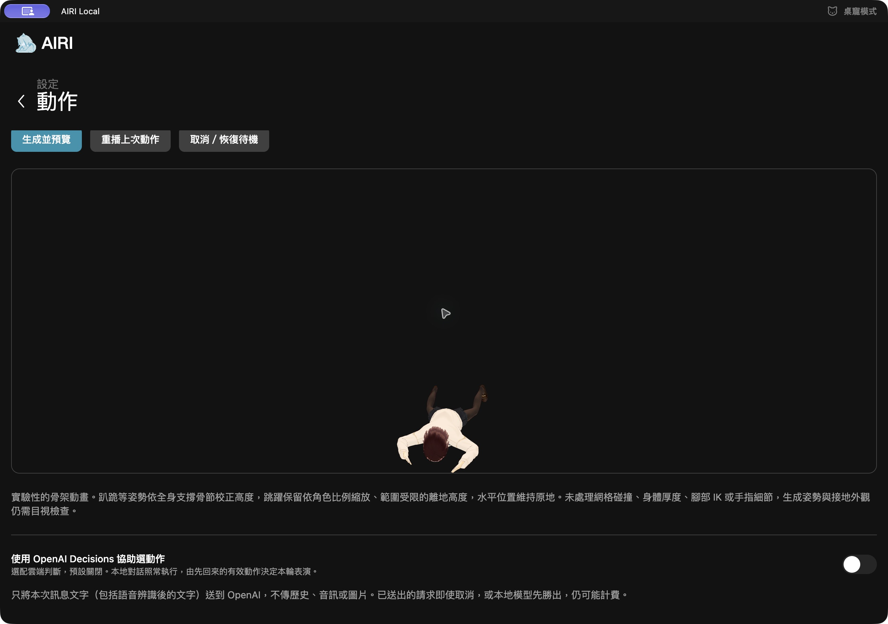
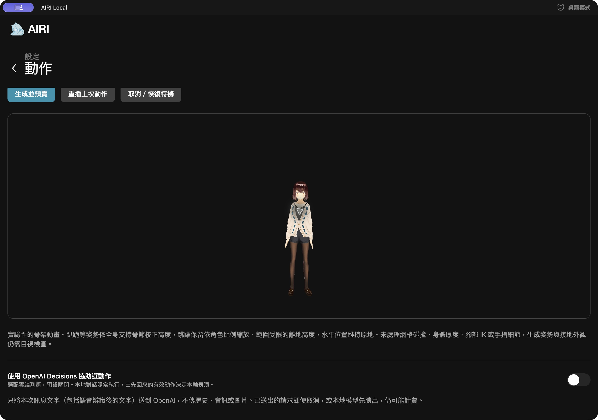

# v0.4.2：趴、跪與地面高度

2026-10-09，Apple M4 Max。修正 MotionGPT 骨架套用到 VRM 時的支撐高度；不是新增物理引擎，也不保證生成模型每次遵照描述。

## 問題與修正

舊版用「目前骨盆 Y − 第一幀骨盆 Y」移動角色。如果第一幀已趴在地上，兩者相減為零，角色仍會從 VRM 的站立高度播放；下移限制也可能不夠低。

新版先完成各骨節旋轉，再量測 VRM 全身的最低支撐骨節，將它對齊角色靜止時的腳／腳趾平面。支撐可以從腳轉移到膝蓋、手或軀幹。進出動畫時保留淡入淡出，停止、播完或換角色會還原位置與旋轉。

來源的地面固定為 HumanML3D 的 Y=0。參考 [MotionGPT 固定版本的前處理](https://github.com/OpenMotionLab/MotionGPT/blob/001aaca8d0ee218fc17f8265d11ac124044fe42f/mGPT/data/humanml/scripts/motion_process.py#L169-L187)：資料先扣除地面高度，之後只移除初始 XZ。生成模型偶爾預測到負 Y，不能因此把整段最低預測值當成新地面，否則整段反而會浮高。

全部 22 個來源關節的最低正 Y 視為離地高度，按角色腿長縮放並限制範圍，所以跳躍不會被每幀拉回地面。有些 VRM 沒有 optional toes；來源離地高度仍用全部 22 個來源關節，不能把較高的踝關節誤當成腳底。

## 真實生成與驗證

固定 MotionGPT Base、MLX／Metal、float32、seed=42。這裡保存五段真實輸出，另沿用 `../jump-language/jump-short-mlx-seed42.json`。每段測試 AvatarSample A、B，以及第四週角色的 VRM 0／1 版本，共 24 組。

| 檔案前綴 | 英文描述 | 觀察 |
| --- | --- | --- |
| prone | A person lies down on their stomach on the ground. | 部分來源影格自身懸空，最高最低關節約 0.416 m；播放器不把這些影格擅自壓平。 |
| prone-static | A person is lying face down on the floor. | 首幀骨盆約 0.049 m，重現舊版低姿勢懸空；這段後來又起身。 |
| kneel | A person kneels on the ground. | 骨盆由約 0.943 m 降至 0.344 m。 |
| kneel-static | A person is kneeling on both knees. | 骨盆最低約 0.454 m，確認膝／手支撐路徑。 |
| fall | A person falls down onto the ground. | 本次骨盆仍約 0.889–1.025 m，沒有真正跌倒；屬於生成不符語意。 |
| jump-short | Jump high! | 確認低姿勢修正不會消除跳躍。 |

最終測量為 `*-retarget-v2-real-vrms.json`，其中保存來源、VRM、renderer SHA256、每幀支撐誤差及停止還原結果。未帶 `v2` 的報告是發現「缺腳趾骨造成虛假離地」前的中間測量，保留追溯，不作最終驗收。

- 24 組在完整播放權重時的支撐面最大誤差約 `3.42e-14` 場景單位；這是數學對齊誤差，不是模型動作準確率。
- `prone-static` 可使骨盆下降約 78.3 cm（A）、74.7 cm（B）、64.0 cm（第四週角色），不再被第一幀基準鎖在站姿高度。
- 跳躍峰值離地仍約 30.7–32.6 cm。第四週缺 toes 的角色不再額外多浮約 5 cm。
- XZ 原地位置不變；左右／前後肢段方向保留。每組中途低姿勢停止與播完後，位置還原誤差均為零。

探針載入真實 VRM 的 node transforms 與 humanoid mapping，沒有載入材質、皮膚網格或渲染器，因此上述數值不代表外觀已零穿模。

## 重現

在 repository root 執行，最後一個參數可換成自己的 VRM：

```sh
node --experimental-strip-types course/ntu-vh2026/desktop/probe-generated-motion-retarget.mjs \
  course/ntu-vh2026/results/motiongpt/ground-contact/prone-static-mlx-seed42.json \
  packages/stage-ui/src/assets/vrm/models/AvatarSample-A/AvatarSample_A.vrm \
  --output /tmp/airi-ground-check.json

pnpm -F @proj-airi/stage-ui-three exec vitest run \
  src/composables/vrm/generated-motion.test.ts \
  src/composables/vrm/semantic-motion.test.ts
```

此輪 generated／semantic 共 48 tests 通過，涵蓋低姿勢起始、膝／手支撐、負 Y 誤差、缺 toes、跳躍、重播、停止與換角色。i18n 22 tests 通過。stage-ui-three、stage-ui、stage-pages、stage-web、i18n 的 typecheck 通過，production web build 通過。Root typecheck 被 Turbo 子程序嘗試安裝 pnpm 11.24 時的本機權限阻擋；root lint 被既有 docs 缺少 `@radix-ui/colors` 阻擋，不能宣稱整個 monorepo 的檢查都通過。

本機 Full App v0.4.2 已打包，通過 `codesign --verify --deep --strict`（ad-hoc，未 notarize）。解鎖後已用原生 App 完成以下畫面檢查。

## 仍需理解的限制

這是骨架支撐面校正，不含身體、鞋底、衣服、頭髮的網格厚度，也沒有碰撞、腳部 IK 或多接觸點約束。不同角色的手脚比例仍可能造成接觸外觀差異。來源模型若未生成跌倒，或自己生成懸空姿勢，高度校正不會捏造另一段動作。課堂可比較同一個描述的不同 seed，把「生成正確」「骨架對齊」「網格接觸」分開評測。


## 原生 App 目視檢查與 v0.4.3 中文短句

2026-10-09，在原生 Full App v0.4.2 的「機體模組 → 動作」使用 MLX／Metal 與目前選用的預設 VRM：

- `A person is lying face down on the floor.`：可看到身體降低並轉為水平趴姿，播完回到原來的站姿高度。
- `A person kneels on the ground.`：重播中後段可看到彎膝並降低身體；取消後回復站姿。
- `A person falls down onto the ground.`：本次片段仍主要站立／踏步，沒有真正倒地，與保存的來源骨架結果一致。
- 這個預覽沒有繪製實體地板，目視檢查確認的是身體高度與播放還原；精確的支撐面數值由前述探針檢查。衣物／手掌等網格接觸不作零穿模保證。




此輪也實際重現 Qwen 0.8B 的中文誤譯：輸入「跪地上」，輸出卻是 `A person lies prone on a ground surface with knees and feet together.`，已把「跪」改成「趴」。格式正確不等於語意正確，這不是接地運算能補救的問題。

v0.4.3 因此加入三句完整匹配的內建對照：

| 中文輸入 | 送進 MotionGPT 的描述 |
| --- | --- |
| 跪地上 | A person kneels on the ground. |
| 趴下來 | A person lies down on their stomach on the floor. |
| 跌倒 | A person falls to the ground. |

只去除兩端空白與末尾單純句末標點。UI 明示「內建短句對照，未使用語言模型翻譯。」；保留原文與實際英文。不會把「不要跪地上」「跪地上再站起來」「用右膝跪地上」套進短句表；這些仍交原本的本機語言模型。這個小表不是通用中文理解，也不保證 MotionGPT 生成符合描述。helper/store 37 項測試、stage-ui／stage-pages typecheck、修改檔案 lint 均通過。


v0.4.3 已在同一台 Mac 的原生 Full App 重測：三個中文短句均顯示上表英文、「內建短句對照」與「已收到動作」，MLX／Metal 服務正常。`跌倒` 對應的 `A person falls to the ground.` 本次仍未真正倒地。App 返回桌寵舞台後，恢復原本已開啟的麥克風狀態。建置與 strict codesign 驗證通過（ad-hoc，未 notarize）；stage-web／i18n typecheck 與 i18n 22 項測試亦通過。
